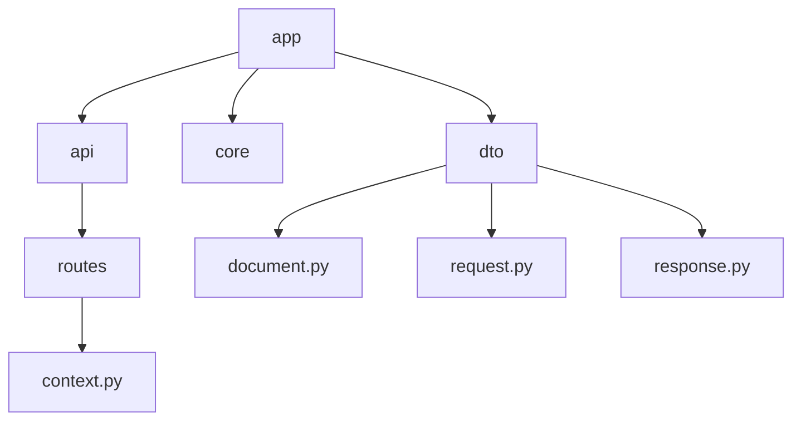

# RAG Module (Retrieval-Augmented Generation)

## Overview

This module implements the Retrieval-Augmented Generation (RAG) service for the Nyx project. It is designed to retrieve relevant documents based on a user query, which can then be used to augment the context for a Large Language Model (LLM).

The module is built using **FastAPI** and adheres to **Clean Architecture** principles, separating concerns into API/Routes, Core Logic (Business Rules), and DTOs (Data Transfer Objects).

## Project Structure



- **api/**: Contains the external interface layers (REST endpoints).
- **core/**: Contains the business logic and use cases (currently placeholder).
- **dto/**: Defines the Data Transfer Objects for strict type validation using Pydantic.

---

## Data Transfer Objects (DTOs)

The module uses Pydantic models to ensure data integrity and provide clear schemas for requests and responses.

### 1. Document

**File**: `app/dto/document.py`

Represents a single piece of retrieved information.

```python
class Document(BaseModel):
    id: str                 # Unique identifier for the document
    score: float            # Relevance score (must be >= 0)
    text: str               # The actual content of the document
    metadata: Dict[str,str] # Additional context (e.g., source, author, date)
```

### 2. RetrieveRequest

**File**: `app/dto/request.py`

Defines the structure of the incoming retrieval request.

```python
class RetrieveRequest(BaseModel):
    query: str              # The search query string
    top_k: int              # Number of top results to return (must be >= 1)
    filters: Dict[str,str]  # Optional filters for the retrieval process
```

### 3. RetrieveResponse

**File**: `app/dto/response.py`

Defines the standard response format.

```python
class RetrieveResponse(BaseModel):
    results: List[Document] # List of retrieved Document objects
```

---

## API Endpoints

### POST /rag/retrieve

Retrieves the most relevant documents for a given query.

- **Description**: Accepts a query and optional filters, performs a search in the knowledge base, and returns a ranked list of documents.
- **Request Body**: `RetrieveRequest` (JSON)
- **Response Model**: `RetrieveResponse` (JSON)

**Example Request:**

```json
{
  "query": "What is the capital of France?",
  "top_k": 3,
  "filters": {
    "category": "geography"
  }
}
```

**Example Response:**

```json
{
  "results": [
    {
      "id": "doc_123",
      "score": 0.95,
      "text": "Paris is the capital of France.",
      "metadata": { "source": "wiki" }
    }
  ]
}
```

---

## Development & Usage

### Prerequisites

- Python 3.9+
- FastAPI
- Pydantic
- Uvicorn (for running the server)

### Running the Module

(Assuming a `run.py` or entry point is configured)

```bash
python -m app.run
```

_Note: The current `run.py` is a skeleton placeholder._

## Standards & Best Practices

- **SOLID Principles**: The separation of DTOs, API routes, and minimal Core dependencies supports Single Responsibility and Open/Closed principles.
- **Type Hinting**: Extensive use of Python type hints (`List`, `Dict`, `str`) for better developer experience and IDE support.
- **Validation**: Pydantic fields (`Ge`, etc.) enforce data constraints at the boundary.
- **Error Handling**: The API routes include global `try-except` blocks to catch unexpected implementation errors gracefully.
